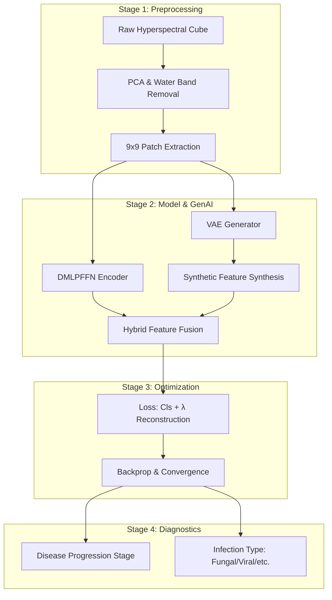

# 🌱 Sugarbeet GenAI: Hybrid Learning for Hyperspectral Crop Disease Identification

This repository contains the implementation of a novel hybrid learning framework for early and reliable crop disease identification using hyperspectral imaging. The project integrates **Deep MLP Feed-Forward Networks (DMLPFFN)** with **Generative Artificial Intelligence (Variational Autoencoders - VAEs)** to enhance spectral–spatial representation learning.

---

## 📄 Abstract

> The proposed model addresses the challenge of early and reliable crop disease identification using hyperspectral imaging under conditions of high spectral dimensionality and limited labelled training samples. Accurate discrimination of disease progression patterns remains difficult due to subtle physiological variations in early infection stages and overlapping spectral responses during intermediate disease manifestation. This study aims to enhance spectral–spatial representation learning and improve robustness for practical precision agriculture applications using hyperspectral datasets of sugar beet and soybean crops.
>
> To achieve this, a novel hybrid learning framework is proposed that follows a structured four-stage workflow. In the initial stage, hyperspectral preprocessing is performed to reduce spectral redundancy, normalize band-wise variations, and preserve localized disease context. The second stage focuses on model development through hierarchical spectral–spatial feature abstraction and adaptive fusion of multi-scale contextual representations. Generative artificial intelligence is incorporated at this stage using a Variational Autoencoder-based augmentation strategy to synthesize realistic spectral patterns and improve feature diversity under constrained dataset conditions. The third stage involves systematic testing and validation to analyse convergence stability and generalization capability across crop domains. The final stage generates classification outputs for both disease progression stages and mid-stage categorization of stress responses associated with fungal, bacterial, viral, and nematode infections.

**Keywords:** hyperspectral imaging; plant disease detection; spectral–spatial learning; generative augmentation; hierarchical feature fusion; precision agriculture.

---

## 🛠️ Four-Stage Workflow

The framework is structured into four distinct phases to ensure robust disease identification:

### 1️⃣ Stage 1: Hyperspectral Preprocessing
- **Dimensionality Reduction:** Automated PCA-based band reduction (from 224 to 96 spectral bands) to eliminate redundancy while preserving 99% variance.
- **Cleaning:** Removal of water absorption bands (1350-1460nm, 1800-1950nm).
- **Spatial Extraction:** Patch-based extraction using a 9×9 spatial window to capture localized disease context.
- **Normalization:** Band-wise spectral normalization to account for variation in lighting and sensor sensitivity.

### 2️⃣ Stage 2: Model Development & GenAI Augmentation
- **DMLPFFN Architecture:** A hierarchical spectral-spatial feature abstraction engine utilizing:
  - **Global Perceptron:** Captures long-range spectral dependencies.
  - **Partition Perceptron:** Focuses on grouped channel interactions.
  - **Local Perceptron:** Employs dilated convolutions (d=1, 2, 3) for multi-scale spatial context.
- **Generative Augmentation (VAE):** A convolutional Variational Autoencoder synthesizes realistic spectral variations, supplementing the training set and improving feature diversity for rare disease manifestations.

### 3️⃣ Stage 3: Systematic Testing & Validation
- **Convergence Analysis:** Monitoring training stability using Cosine Annealing learning rate schedules and Early Stopping.
- **Generalization Check:** Comparative analysis between baseline CNNs and the proposed DMLPFFN + GenAI hybrid across multiple crop domains.

### 4️⃣ Stage 4: Classification Outputs
- **Progression Mapping:** Categorization into 4 stages of disease manifestation (Early, Mid-Stage 1, Mid-Stage 2, Advanced).
- **Stress Response Categorization:** Capable of discriminating between stress responses associated with **fungal, bacterial, viral, and nematode** infections.

---

## 📊 System Architecture



---

## 📈 Experimental Results

The following results were obtained on the sugarbeet hyperspectral dataset (96 bands, 9x9 patches):

| Model Configuration | Test Accuracy | Precision (Avg) | Recall (Avg) | F1-Score (Avg) |
|:--- |:---:|:---:|:---:|:---:|
| **CNN Baseline** | 82.80% | 0.8323 | 0.8214 | 0.8259 |
| **CNN + GenAI (Offline)** | 84.08% | 0.8371 | 0.8298 | 0.8322 |
| **DMLPFFN (Baseline)** | 96.82% | 0.9664 | 0.9689 | 0.9674 |
| **DMLPFFN + GenAI (Hybrid)** | **98.09%** | **0.9777** | **0.9802** | **0.9788** |

### Key Observations:
- **GenAI Impact:** The inclusion of VAE-based augmentation improved the DMLPFFN accuracy by ~1.3% and the CNN baseline by ~1.2%, proving the effectiveness of synthetic pattern synthesis in low-label scenarios.
- **Architecture Efficiency:** DMLPFFN significantly outperformed standard CNN architectures due to its multi-scale perceptron blocks that better capture fine-grained hyperspectral variations.

---

## 🚀 Getting Started

### 1. Installation
```bash
pip install torch torchvision numpy matplotlib scikit-learn
```

### 2. Prepare Data
Ensure your `.npy` hyperspectral files are in the directory specified in `config.py` (default: `sugarbeet/`). Files should be named with their corresponding Days After Inoculation (e.g., `beet_dai_5.npy`).

### 3. Run Experiments
To train the VAE and run the full benchmarking pipeline:
```bash
python train_vae.py
python main_experiment.py
```

---

## 📝 Authors & Research
This work is part of a research paper on **Hyperspectral Precision Agriculture**.

- **Primary Researchers:** Tanay Kapoor & Team
- **Focus:** Early Diagnostic Support & Data-Driven Decision Making

---
*For any inquiries regarding the implementation or dataset usage, please refer to the project documentation in the `docs/` folder (if applicable).*
